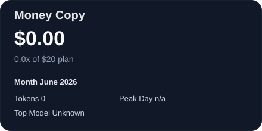
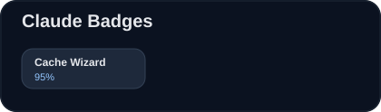
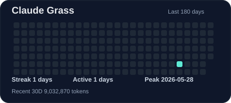

# HWANG SUBIN (BINI)

  
  

 

## 🧑‍💻 About Me
---
* 🎓 **나노물리학 / 소프트웨어학** 학사 졸업 (총 평점 4.36 / 4.5)
* 🌟 **성실함과 책임감**을 바탕으로 주변의 문제를 창의적으로 해결하는 개발자 지망생입니다.
* 📧 **Contact:** subin9227@gmail.com

 

## 🛠 Tech Stacks
---
### Language & Software
      

### Productivity & Tools
    

 

## 💼 Experience & Projects
---
### 📌 **홍익대학교 기초과학과** | 실험 행정 및 교육 조교 (2023.03 ~ 2025.03)
* **실험 고도화:** 30주차 분량의 물리 실험 검토 및 교재 수정 편집
* **수업 운영:** 실험 영상 촬영/편집 및 강의 자료(PPT, Excel) 제작
* **운영 관리:** 기초 실험 장비 점검 및 조교 회의 총괄 진행

### 📌 **AI 특화 캠퍼스 (Microsoft AI Engineer)** | 2025.12 ~ 2026.03

| 프로젝트 (역할) | 핵심 성과 및 기술 스택 | 링크 |
| :--- | :--- | :---: |
| **최종: '잔향'** (Scentive AI 개발) | • **감정-향 치환 알고리즘 개발**: 사용자 감정 데이터를 분석해 최적의 향기를 추천하는 로직 설계 (**🏆1등 수상**) • UI/UX 제작 및 데이터 전처리 수행 | [🎥유튜브 보러가기](https://youtube.com/shorts/nYi8mjsfV_M?si=eeJ7ijwEloDH7rVR) |
| **1차: CareerChain** (AI 면접관 서비스) ) | • **맞춤형 면접 시스템**: 꼬리 질문 생성 알고리즘 개발 (**🏆1등 수상**) • 시스템 에러 수정 및 QA를 통한 서비스 안정성 확보 | [🎥유튜브 보러가기](https://www.youtube.com/watch?v=d7kL5bwAQjE) |

### 📌 **Personal Projects** | 개인 프로젝트

| 프로젝트 | 핵심 기능 및 주요 기술 스택 | 링크 |
| :--- | :--- | :--- |
| **tenminute**  | • **감성형 10분 플래너**: 하루를 잘게 쪼개 기록하고 싶은 사람들을 위한 시간 관리 솔루션 • 미루는 습관 교정 및 생산성 향상을 위한 스케줄링 기능 제공 | [🌐텐미닛 작성하러가기](https://tenminute-wheat.vercel.app/) |
| **account-book**  | • **영수증 기반 가계부 웹앱**: 영수증 촬영 시 품목 자동 분류 시스템 구축 (**Google Vision OCR → GPT-4o-mini**) • 소비 패턴 시각화 및 날짜별 가격 변동 추적 알고리즘 구현 | [🌐linkedin 소개글 보러가기](https://www.linkedin.com/posts/subin-linda-hwang_ocr-gpt-ai-activity-7446832827918299136-fHud?utm_source=social_share_send&utm_medium=member_desktop_web&rcm=ACoAADfcsmUB2HOXLUP0VusWz6LnwTMZWJLccTA) |
| **mapbusim**  | • **토스 미니앱 기반 커뮤니티**: 개인화 온보딩 질문 인터페이스를 통한 유저 성향 분석 • 사용자의 답변을 기반으로 맵기 레벨을 측정하고 레벨 분포 확인 | [🌐맵부심테스트 하러가기](https://minion.toss.im/bsfvbbzg) |

 

## 🏆 Honors & Awards
---
* **청년취업사관학교 [Microsoft AI Engineer] 최종 프로젝트 1등** (2026.03)
* **청년취업사관학교 [Microsoft AI Engineer] 1차 프로젝트 1등** (2026.01)
* **한국경영학회 [대학생 K-기업가정신] 경진대회 장려상** (2022.11)
* **국가우수장학금 [이공계, 2년 지원] 전액장학금** (2021 ~ 2022)
* **교내 [친환경캠페인] 우수상** (2022.12)

 

## 🚀 Activities
---
* **ESG 경영 동아리 (EJ):** MSCI ESG 데이터 분석 및 뉴스레터 발간
* **가천대학교 튜터링:** 글로벌캠퍼스 물리 및 SW 기초교양 조교/튜터 활동
* **보드게임 동아리 (리더스):** 기획부장으로서 게임 제작 스터디 및 활동 기획

 

## 🟩 My GitHub Calendar

<!--
## 📊 GitHub Stats

-->

 

<!-- CLAUDE_PROFILE_STATS:START -->
## Claude Karma

<!-- generated for Subin9227 -->
<!-- CLAUDE_PROFILE_STATS:END -->
